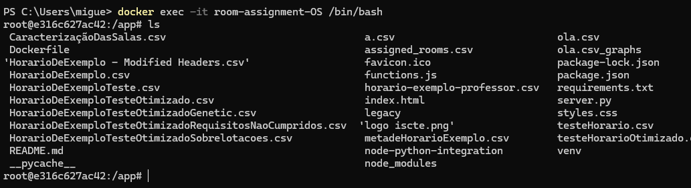
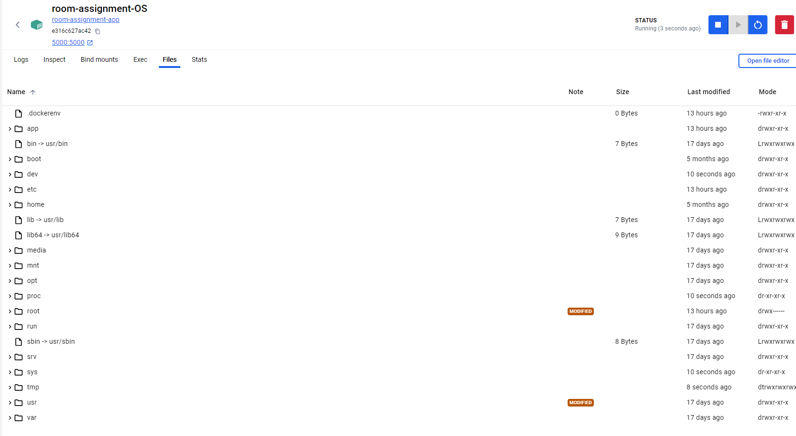

# Projeto de ICO - 	Grupo G
## Otimização de Alocação de Salas
Este repositório contém o 2º projeto da disciplina de Inteligência Computacional e Otimização.
Este projeto tinha como objetivo exploraar e concretizar uma solução para otimizar a alocação de salas usando algoritmos genéticos e técnicas de otimização multiobjetivo.

## Funcionalidades
- Otimização single e multiobjetivo para alocação de salas.
- Lida com a capacidade das salas e requisitos pedidos.
- Gera vários gráficos e plots para visualizar os resultados da otimização.
## Como correr o algoritmo
### Via local
Para poder correr a aplicação localmente, siga os seguintes passos:

Entre na pasta source e abra-a com um IDE (por exemplo, VSCODE).
Certifique-se de que tem o Python instalado na sua máquina. Pode verificar a instalação do Python com o comando:

```console
python --version
```
Instale as dependências necessárias executando o comando:

```console
pip install -r requirements.txt
```
Execute o ficheiro server.py para iniciar o back-end:
```console
python server.py
```
Abra o ficheiro index.html num browser para utilizar a interface front-end.
### Docker
Correr o algoritmo em docker:
```console
docker build -t room-assignment-app .       
docker run --name room-assignment-OS -p 5000:5000 room-assignment-app
```

Aceder ao ficheiros:
```console
docker container ls
docker exec -it room-assignment-OS /bin/bash
```


ou utilizando o Docker Desktop:



Para uma análise mais aprofundada da performance da otimização multi-objetivo, pode consultar os gráficos correspondentes ao horário otimizado.
